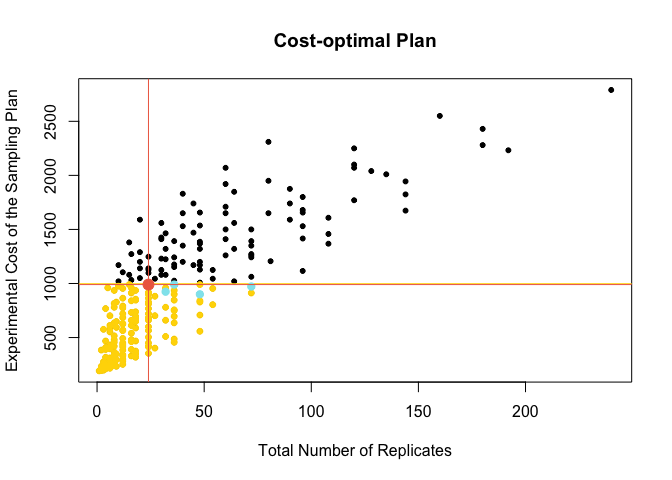

# Cost-effective Experimental Design

#### Overview

This is an R Markdown document. For further clarification of this code, read " Design and Sampling Plan Optimization for RT-qPCR Experiments in Plants: A Case Study in Blueberry" by Die, Roman, Flores and Rowland (in preparation). 

####0. Dependencies

This document has the following dependencies:

```r
library(dplyr)
```
  
  
####1. Set the number of potential replicates (1 to X) for each of the sample processing steps

```r
nsubject = 5
nrna = 4
nqpcr = 3
nrt=4
```
  
  
####2. Build a general matrix of potential sampling plans (as dataframe)

```r
c.subject = rep(c(1:nsubject),each=nrna*nrt*nqpcr)
c.rna =rep(rep(c(1:nrna),each=nrt*nqpcr),nsubject)
c.rt = rep(rep(c(1:nrt),each=nqpcr),nsubject*nrna)
c.qpcr = rep(rep(c(1:nqpcr),nrt),nrna*nsubject)

#Check that all columns are equal length 
length(c.subject) == length(c.rna) & length(c.subject)== length(c.rt) & length(c.subject)== length(c.qpcr)
```

```
## [1] TRUE
```

```r
#Build the dataframe of sampling plans
dat <- tbl_df(data.frame(subject =c.subject,RNA =c.rna,RT=c.rt,qPCR =c.qpcr))
```
  
  
####3. Define a function to estimate the variance (or SD) of the mean Cq or "Total expected variation""

```r
total.var = function(nsubject,nrna,nrt,nqpcr) {
  mean.var  <-  rna/(nsubject*nrna) + rt/(nsubject*nrna*nrt) +
            qpcr/(nsubject*nrna*nrt*nqpcr)
}
```
  
  
####4. Enter the variation (or SD) observed from the pilot experiment

```r
# Example 4A. Mean GOIs, Tissue = leaves
n.genes = 3
rna =(0.43+0.02+0.64) / n.genes
rt =  (0.73+0.28+0.53) / n.genes
qpcr = (0.32+0.18+0.49) / n.genes
# Example 4B. Mean GOIs, Tissue = fruits
n.genes = 3
rna = (0.41+0.42+0.43)/n.genes
rt =  (0.34+0.31+0.29)/n.genes
qpcr = (0.30+0.27+0.35)/n.genes
```
  
  
####5. Estimate the total expected variation (mean Cq) per sampling plan and add those values to the data frame

```r
dat <- mutate(dat, Total.Mean = round(total.var(subject,RNA, RT, qPCR),2))
```
  
  
####6. Create a new variable (total number of replicates) and add those values to the data frame

```r
dat <- mutate(dat,Total.Rep=subject*RNA*RT*qPCR)
```
  
  
####7. Enter the unitary cost throughout sample processing

```r
cost.sub = 50
cost.rna = 10
cost.RT = 3
cost.qPCR = 1
```
  
  
####8. Estimate cost for each sampling plan and add those values to the data frame

```r
meanDat <- mutate(dat, Sampling.Cost = subject*cost.sub + (RNA*subject*cost.rna) + 
          (RT*RNA*subject*cost.RT) + (qPCR*RT*RNA*subject*cost.qPCR)) %>%
      arrange(Sampling.Cost, desc(Total.Rep), desc(Total.Mean)) %>%
      select(Sampling.Cost, Total.Rep, Total.Mean, subject, RNA, RT, qPCR)
```
  
  
####9. Enter the requirements for the actual experiment

```r
time.points = 3
budget = 1000
```
  
  
####10. Create an index to identify sampling plans limited by the available budget

```r
ind <- which(meanDat$Sampling.Cost*time.points < budget)
```
  
  
####11. Plot the experimental plans and identifies those within the available budget

  
  
####12. Get the sampling plan (out of those within the available budget) showing the minimum variance (or SD)
#####In other words: out of the different sampling plans, what is the minimum variance that we can find?

```r
min.var <- min(meanDat[ind,3])
min.var
```

```
## [1] 0.07
```
  
  
####13. Get and plot the sampling plan(s) showing the minimum variance (or SD)

```r
#Get the sampling plan(s) 
target = which(meanDat[ind,3] == min.var)
meanDat <- rename(meanDat, Cost.TP=Sampling.Cost)
meanDat[target,]
```

```
## Source: local data frame [5 x 7]
## 
##   Cost.TP Total.Rep Total.Mean subject   RNA    RT  qPCR
##     (dbl)     (int)      (dbl)   (int) (int) (int) (int)
## 1     300        48       0.07       2     4     3     2
## 2     308        32       0.07       2     4     4     1
## 3     324        72       0.07       2     4     3     3
## 4     330        36       0.07       3     3     2     2
## 5     330        24       0.07       3     4     1     2
```

```r
#Plot the sampling plan(s): identify plans with unique total number of replicates
plot(meanDat$Total.Rep, meanDat$Cost.TP*time.points, pch=20, main="Cost-optimal Plan",
     xlab="Total Number of Replicates", ylab="Experimental Cost of the Sampling Plan")
points(meanDat$Total.Rep[ind], (meanDat$Cost.TP*time.points)[ind],
       col="gold1", cex=0.8, bg="gold1", pch=21) 
abline(h=budget, col="gold1",lwd=0.8)
points(meanDat$Total.Rep[target], 
       (meanDat$Cost.TP*time.points)[target], 
       col="cadetblue2", cex=1, bg="cadetblue2", pch=21) 
```


  
  
####14. Get and plot the OPTIMAL PLAN (out of those showing the minimum variance)

```r
#14.1 Criteria 1: plan that requires less final replicates
ind2 <- which(meanDat[target,2]==min(meanDat[target,2]))
#Find the optimal sampling plan
meanDat[target[ind2],]
```

```
## Source: local data frame [1 x 7]
## 
##   Cost.TP Total.Rep Total.Mean subject   RNA    RT  qPCR
##     (dbl)     (int)      (dbl)   (int) (int) (int) (int)
## 1     330        24       0.07       3     4     1     2
```
  
Plot the optimal sampling plan accordingt to critera 14.1

  

```r
#14.2 Critera 2: plan that is least expensive
meanDat[target[1],]
```

```
## Source: local data frame [1 x 7]
## 
##   Cost.TP Total.Rep Total.Mean subject   RNA    RT  qPCR
##     (dbl)     (int)      (dbl)   (int) (int) (int) (int)
## 1     300        48       0.07       2     4     3     2
```
  
Plot the optimal sampling plan according to criteria 14.2

  
##### SessionInfo

\scriptsize


```
## R version 3.2.2 (2015-08-14)
## Platform: x86_64-apple-darwin13.4.0 (64-bit)
## Running under: OS X 10.10.5 (Yosemite)
## 
## locale:
## [1] es_ES.UTF-8/es_ES.UTF-8/es_ES.UTF-8/C/es_ES.UTF-8/es_ES.UTF-8
## 
## attached base packages:
## [1] stats     graphics  grDevices utils     datasets  methods   base     
## 
## other attached packages:
## [1] dplyr_0.4.3
## 
## loaded via a namespace (and not attached):
##  [1] Rcpp_0.12.2     digest_0.6.8    assertthat_0.1  R6_2.1.1       
##  [5] DBI_0.3.1       formatR_1.2.1   magrittr_1.5    evaluate_0.8   
##  [9] stringi_1.0-1   lazyeval_0.1.10 rmarkdown_0.9   tools_3.2.2    
## [13] stringr_1.0.0   yaml_2.1.13     parallel_3.2.2  htmltools_0.3  
## [17] knitr_1.11
```

This document was processed on: 2016-02-11
