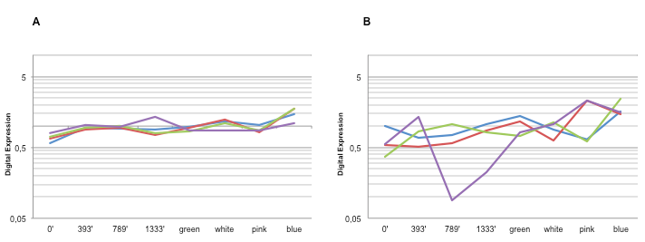

We have described an excellent set of reference genes for use in real-time PCR studies of blueberry and related plants of the *Ericaceae* 
family.  
  
The following figure shows the in silico expression of our new set of reference genes (**A**) and the expression levels of common genes 
used in blueberry research: ACT, metallothionein, GAPDH and EF1a (**B**).  

A. Relative virtual expression of unigenes from the 454 transcriptome database representing putative orthologs to Arabidopsis genes UBC9 (96% and 93% identity at the amino acid level, respectively; red and blue), UBC28 (92% identity; green) and RH8 (45% identity; purple). B. Relative virtual expression of former frequently used blueberry reference genes in qPCR analyses, i.e. ACT (red), metallothionein (purple), GAPDH (blue) and EF1a (green).  

 

Primer sequences, statistical analysis and assessment of gene expression of the novel reference genes are shown in:  
  
Die JV, Rowland LJ (2013) Superior Cross-Species Reference Genes: [A Blueberry Case Study](http://journals.plos.org/plosone/article?id=10.1371/journal.pone.0073354). PLoS ONE 8(9): e73354. doi:10.1371/journal.pone.0073354
  

