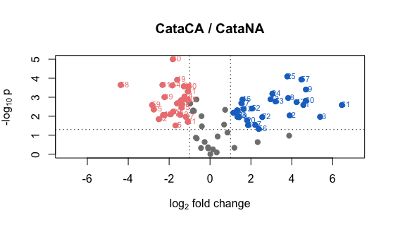
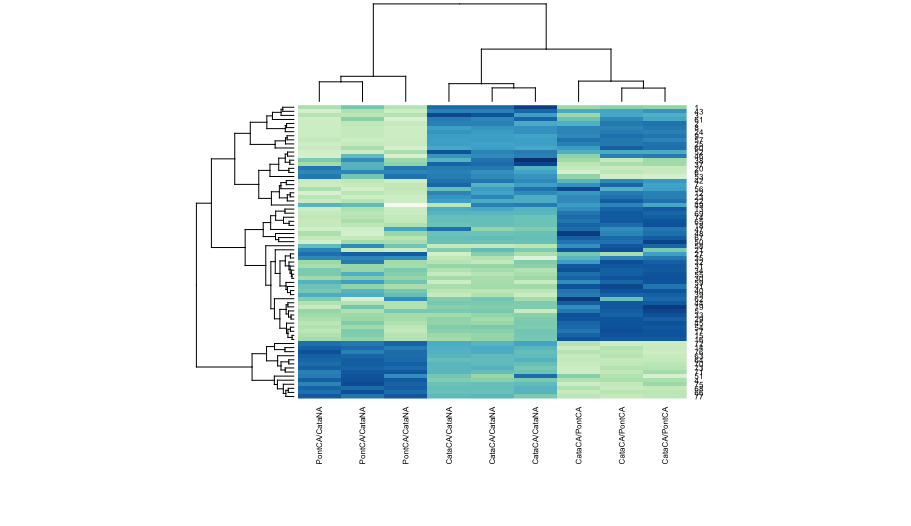

Die JV, Arora R, Rowland LJ (2017) [Proteome dynamics of cold-acclimating Rhododendron species contrasting in their freezing tolerance 
and thermonasty behavior](http://journals.plos.org/plosone/article?id=10.1371/journal.pone.0177389). PLoS ONE 12(5): e0177389. 
doi:10.1371/journal.pone.0073354    

---  

To gain a better understanding of cold acclimation in rhododendron, blueberry and in woody perennials in general, we used the 2D-DIGE 
technique to analyze the rhododendron proteome during the seasonal development of freezing tolerance. We selected two species varying 
in their cold acclimation ability as well as their thermonasty response (folding of leaves in response to low temperature).

  
**Figure 1 Volcano plot** Each dot represents one of the reproducible protein spots, with the –log10 of the P value plotted against 
the abundance difference between two biological conditions (log2 on the abscissa). Blue color denotes increased protein levels; red color 
denotes decreased protein levels; grey color denotes spots in meaningful sectors (effect factor <|2-fold|, P >0.05, or both).  

    
**Figure 2 Hierarchical clustering** of differentially accumulated spots. Columns represent sample comparisons, while rows represent 
individual proteins.   
