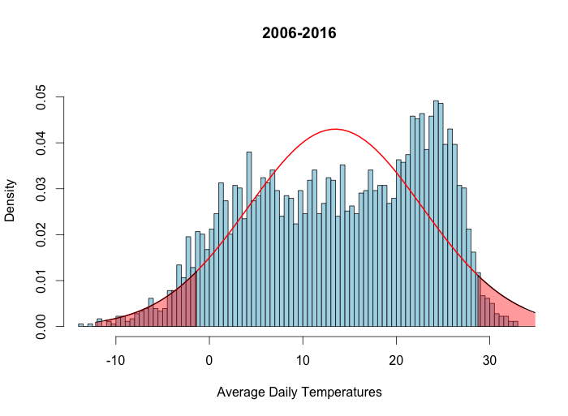

# Summary Avg. Daily Temperatures
Jose V. Die  
March 1, 2016  

**Average Daily Temperatures in Beltsville (MD). Data set 1.**  
Temperatures are shown in ºC.  

Data are approximately normal distributed.  

* Mean temperature (1995-2005) = 13.46ºC    
* 48 days with higher tmeperatures above the 95th percentile.   
* 247 days with lower temperatures below the 5th percentile.  

   

**Average Daily Temperatures in Beltsville (MD). Data set 2.**  

* Mean temperature (2006-2016) = 13.87ºC  
* 83 days with higher tmeperatures above the 95th percentile.   
* 325 days with lower temperatures below the 5th percentile.  

